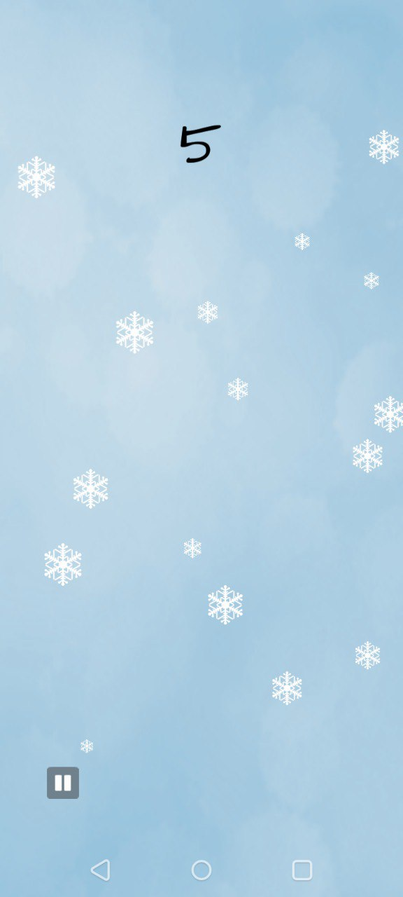

# Snowfall

    

    Enjoy the tranquil beauty

Welcome to Snowfall, a delightful game where you can experience the magic of snowflakes with a simple click. Each delicate snowflake awaits your touch, disappearing in a twinkling flurry as you interact with them on the screen. Explore the serene winter landscape and enjoy the satisfying sensation of making the snowflakes vanish with each tap. Whether you're looking for a calming pastime or a bit of interactive fun, Snowfall invites you to engage with its enchanting world of disappearing snowflakes.

## Screenshots

    
    
    

